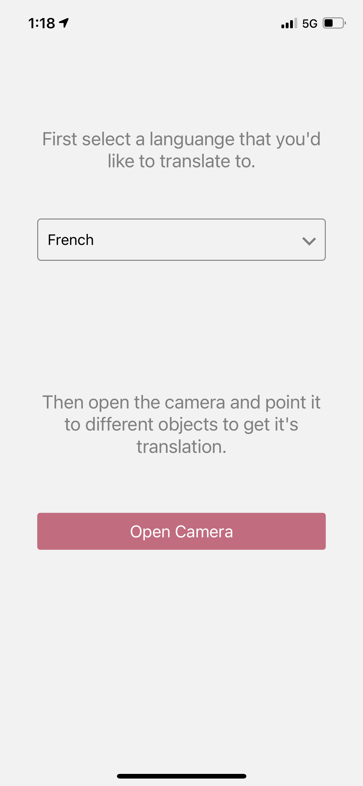
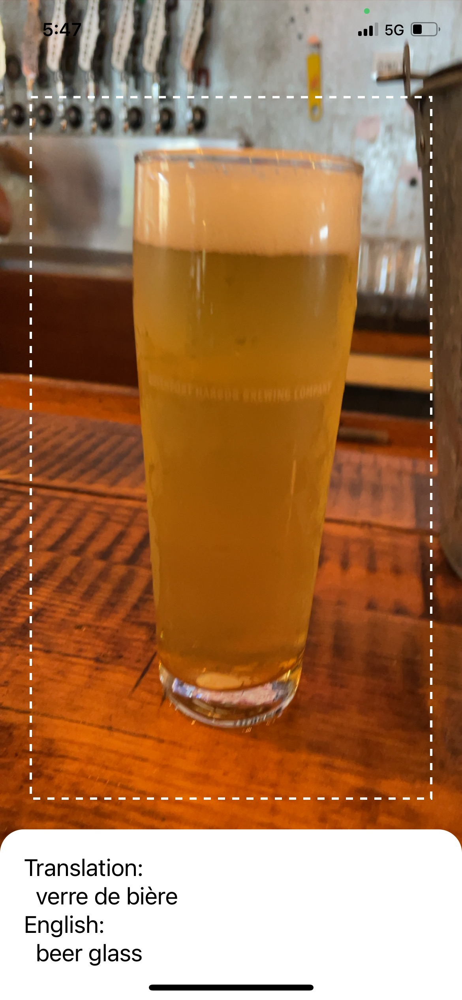

React Native Live Camera Classifier classifies an object in real-time and will also translate the object to the language that you specify.

|                                                          |                                                          |
| -------------------------------------------------------- | -------------------------------------------------------- |
|  |  |

##Run the app

- Obtain a Google Translate API key from [here](https://cloud.google.com/translate/docs/setup#node.js)
- `yarn install`
- `expo start`
